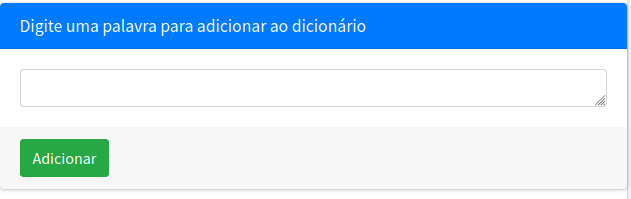

# Grammar

>"*It's impossible to use dynamic in a pejorative sense.*" - Richard E. Bellman

**Conteúdo da Disciplina**: Programação Dinâmica 

## Alunos
| Matrícula | Aluno |
| -- | -- |
| 211029620 | Douglas Alves dos Santos |
| 211039297 | Bruno Martins Valério Bomfim |

## Sobre 
**Grammar** é um projeto desenvolvido em python para o módulo de Programação Dinâmica, cujo propósito é realizar a correção ortográfica de uma determinada cadeia de caracteres a partir de um dataset de palavras da língua portuguesa e o algoritmo de **Alinhamento de Sequências**.

## Screenshots
### Exemplo 1: entrada ortograficamente correta

Imagem 1: Testando o algoritmo com entrada ortograficamente correta (Fonte: autores, 2023).

### Exemplo 2: entrada com erros ortográficos

Imagem 2: Testando o algoritmo com entrada ortograficamente incorreta (Fonte: autores, 2023).

### Feature: adicione as suas próprias palavras ao dicionário!

Imagem 3: Adicionando novas palavras (Fonte: autores, 2023).

## Instalação 

**Linguagens e frameworks**: 

  

Para executar este jogo localmente, certifique-se que você possui o Python (>= 3.10.12) instalado em sua máquina. Caso não possua, você pode baixá-lo [no site oficial](https://www.python.org/downloads/).

É necessário também ter o gerenciador de pacotes pip (>= 22.0.2) instalado. Caso não possua, você pode baixá-lo [aqui](https://pypi.org/project/pip/).

*Grammar* foi desenvolvido com base no framework [django](https://www.djangoproject.com/). Para instalá-lo, execute o seguinte comando no terminal:

    pip install django==4.2.6

Em seguida, clone o repositório com o comando

    git clone git@github.com:projeto-de-algoritmos/PD_Grammar.git
## Uso 
Depois de haver instalado as dependências necessárias e clonado o repositório na sua máquina local, a partir da raiz da repositório, execute o comando
    python3 manage.py runserver

Após isto, utilize seu navegador de preferência para acessar o servidor local disponível no endereço `http://127.0.0.1:8000/`.

## Apresentação
Para a explicação dos principais algoritmos utilizados e da estrutura do projeto, gravamos um vídeo explicativo em formato .mp4, o qual deve ser baixado para ser assistido.

Acesse o vídeo [aqui](assets/apresentacao.mp4)